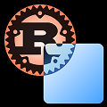

# blend2d-rs

This crate provides rust bindings to the 
[blend2d](https://github.com/blend2d/blend2d) lib.

- This project is currently WIP and therefor incomplete, due to this the crate
will most likely go through breaking changes until a proper api has been
figured out. Bear in mind that blend2d itself is also still in beta,
meaning changes in their api will most likely be reflected in this crate
as well in one way or another. This also means that some functionality
is currently not correctly(or at all) implemented, for example, filling
a context with an image will currently return an `InvalidValue` error.

- Almost nothing is documented at this point so if confusion arises it
might help to check out the C++ 
[docs](https://blend2d.com/api/index.html). 
This will hopefully change in the near future.

- Not everything has been tested, so bugs might occur.

## Setup

This crate requires [CMake](https://cmake.org/) to be installed and available on `PATH`.

Also make sure to initialize the submodules after cloning the repository(`git submodule update --init`).

## Examples

You can find the examples [here](./examples).

## Current Design Decision
- The [Clone Trait](https://doc.rust-lang.org/std/clone/trait.Clone.html)
is currently implemented in such a way that it does weak clones by using
the underlying ref-counting of blend2d. Deep clones can be achieved by 
using the corresponding DeepClone Trait.
- OutOfMemory errors returned by blend2d will as of now panic the 
program by default.
## License

Licensed under either of

 * Apache License, Version 2.0, ([LICENSE-APACHE](LICENSE-APACHE) or http://www.apache.org/licenses/LICENSE-2.0)
 * MIT license ([LICENSE-MIT](LICENSE-MIT) or http://opensource.org/licenses/MIT)

at your option.

The Rust logo is owned by Mozilla and distributed under the terms of the
[Creative Commons Attribution license (CC-BY)](https://creativecommons.org/licenses/by/4.0/).

### Contribution

Unless you explicitly state otherwise, any contribution intentionally
submitted for inclusion in the work by you, as defined in the Apache-2.0
license, shall be dual licensed as above, without any additional terms or
conditions.
